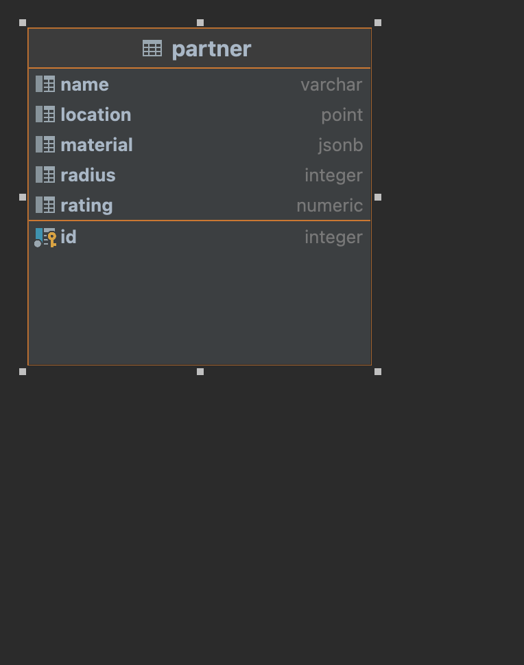

# Matching Service

This service matches partners (craftsman) to a customer based
on their project requirements.

## Requirements
Have the following installed on your machine foe the project to RUN
1. Docker
2. Docker-compose

## Technologies Used
1. Go as the programming language
2. Postgres as the database
3. Docker to build and run the database

### How To Run The Service
To run the service run the following command on the root level of the project

``
make build
``
<br></br>
This will start up build and start up the app with all its dependencies including starting the database and performing migrations

To run tests, run the following command on the root level of the project

``
make tests
``

## Endpoints
```http
BASE_URL localhost:8080/matching-service/
```

1. Health Check
```http
GET {BASE_URL}/health-check
```
This endpoint does a simple ping to the server to check if its running

#### Responses

This endpoint returns a simple string if the app is running

```javascript
healthy
````
#### Status Codes

The health check returns the status codes

| Status Code | Description                                       |
| :--- |:--------------------------------------------------|
| 200 | `App is running`                                  |
| 500 | `Service can't be reached` |

<br></br>
2. Get Partner Details
```http
GET {BASE_URL}/partner?id={id}
```

#### Responses

```javascript
{
    "result": [
        {
            "name": string,
            "location": string,
            "material": [
                string,
                string
            ],
            "radius": int,
            "rating":float
        }
    ],
    "error": bool,
    "message": string
}
```
The `result` field holds an array that holds the requested partners details, incase of an error this field will be nil

The `error` field holds a boolean indicating whether the request was successful or not

The `message` field holds a string that has the error message incase of an error and `success` when request is successful

The `result.name` field holds the partners name

The `result.material` field an array of materials that the partner can handle

The `result.radius` holds the operating radius of the partner as an int

The `result.rating` holds the partners rating


| Status Code | Description                                             |
|:------------|:--------------------------------------------------------|
| 200         | `Request was successful`                                |
| 400         | `Client request is malformed i.e wrong id data type`    |
| 500         | `Service expereinced an error while processing request` |

<br></br>
3. Get Partners Matching Request
```http
POST {BASE_URL}/partners
```

#### Request

```javascript
{
    "material":string,
    "lat":float,
    "long":float, 
    "floor_size":float,
    "phone":string
}
```

The `material` is the clients needed material

The `lat` is the clients latitude

The `long` is the clients latitude

The `floor_size` is the clients floor size

The `phone` is the clients phone number

#### Responses

```javascript
{
    "result": [
        {
            "name": string,
            "location": string,
            "material": [
                string,
                string
            ],
            "radius": int,
            "rating":float
        }
    ],
    "error": bool,
    "message": string
}
```
The `result` field holds an array that holds matching partners, based on the clients request, in case of an error this field will hold nothing

The `error` field holds a boolean indicating whether the request was successful or not

The `message` field holds a string that has the error message incase of an error and `success` when request is successful

The `result.name` field holds the partners name

The `result.material` field an array of materials that the partner can handle

The `result.radius` holds the operating radius of the partner as an int

The `result.rating` holds the partners rating


| Status Code | Description                                                                         |
|:------------|:------------------------------------------------------------------------------------|
| 200         | `Request was successful`                                                            |
| 400         | `Client request is malformed i.e wrong phonenumber format or unrecognized material` |
| 500         | `Service expereinced an error while processing request`                             |


#### Recognized Material Types
1. `tiles`
2. `carpet`
3. `wood`

## Database Structure
THe service has one table the `partner` table with the following structure


#### Note
The `.env` file has been committed to help with testing of the app, in practice this file or its contents will npt be committed

